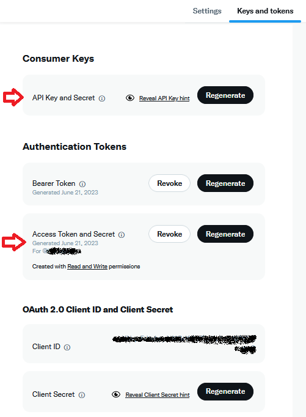
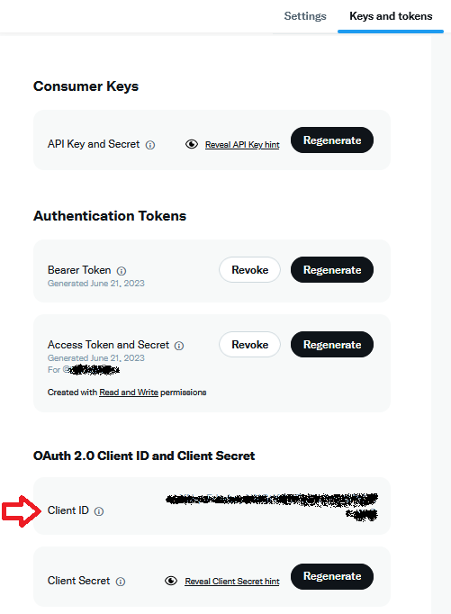
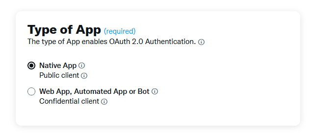

# XbyOpenApi
This is a C# sample for accessing the X/Twitter REST API with a Kiota generated client and OAuth1 / OAuth2.

A few years ago, several .NET libraries existed to access Twitter. But then Twitter limited their free api to just a few endpoints, and most 
open source libraries were discontinued (e.g. [TweetInvi](https://github.com/linvi/tweetinvi/)). Some time later, Twitter updated the REST api
to version 2, and the old libraries stopped working or needed workarounds.

But there is hope: using the OpenAPI description at https://api.twitter.com/2/openapi.json, you can use tools like [Microsoft Kiota](https://github.com/microsoft/kiota/)
to generate a client which should (in theory) make it easy to call any endpoint.

The only problem is authorization. X currently supports OAuth1 and OAuth2. Using either of those two protocols, you have to fetch an access token to make API calls.

Here comes this sample into play. You can use the sample code to implement your own X client (it is not much magic involved ;-)). Or you could use the Nuget packages that I created
from the sample.

To start: take a look at my [WinForms sample application](https://github.com/WolfgangHG/XbyOpenApi.NET/tree/main/XByOpenApi.Sample.WinForms). 

I have only a free access X account, so if there are questions, maybe I cannot help.

# Table of Contents

- [How the code works](#how-the-code-works)
- [How to use the Nuget packages](#how-to-use-the-nuget-packages)
- [Using the X client](#using-the-x-client)
- [Using OAuth1](#using-oauth1)
  - [Using OAuth1 in a WinForms app](#using-oauth1-in-a-winforms-app)
    - [Step 1: fetching an OAuth1 access token](#step-1-fetching-an-oauth1-access-token)
    - [Step 2: reusing the OAuth1 access token](#step-2-reusing-the-oauth1-access-token)
  - [Using OAuth1 in a non WinForms app](#using-oauth1-in-a-non-winforms-app)
- [Using OAuth2](#using-oauth2)
  - [Redirect url](#redirect-url)
  - [Public or confidential client](#public-or-confidential-client)
  - [Scopes](#scopes)
  - [Code challenge](#code-challenge)
  - [Using OAuth2 in a WinForms app](#using-oauth2-in-a-winforms-app)
    - [Step 1: fetching an OAuth2 access token](#step-1-fetching-an-access-token)
    - [Step 2: using the OAuth2 refresh token](#step-2-using-the-oauth2-refresh-token)
  - [Using OAuth2 in a non WinForms app](#using-oauth2-in-a-non-winforms-app)

# How the code works

[Here](doc/Kiota.md) you find a description on how to create a C# client using Kiota.

The client must authorize. This can be done with OAuth1 (see [here](doc/OAuth1.md)) or OAuth2 (see [here](doc/OAuth2.md)). When working on this sample,
I focused on the flow to perform actions on behalf of a user. For OAuth2, there exists also an app-only Bearer Token,
but this one is supported for only a few endpoints (that are not accessible with free access), so I didn't dig deeper.


# How to use the Nuget packages

If you want to use my code without copying it to your own app, you could use the Nuget packages built from this sample:

* [https://www.nuget.org/packages/XbyOpenApi.Core/](XbyOpenApi.Core) is the core REST client generated by Kiota (with one workaround for media upload), and nothing else.
It supports `netstandard2.0`.
* [https://www.nuget.org/packages/XbyOpenApi.OAuth1/](XbyOpenApi.OAuth1) contains some utility functions to perform OAuth1 authentication
independent of the UI framework. It supports `netstandard2.0`. More details below.
* [https://www.nuget.org/packages/XbyOpenApi.OAuth1.WinForms/](XbyOpenApi.OAuth1.WinForms) contains some a bit of WinForms GUI for fetching an OAuth1 access token.
It supports `net8.0-windows` and `net48`.
* [https://www.nuget.org/packages/XbyOpenApi.OAuth2/](XbyOpenApi.OAuth2) contains some utility functions to perform OAuth2 authentication
independent of the UI framework. It supports `netstandard2.0`. More details below.
* [https://www.nuget.org/packages/XbyOpenApi.OAuth2.WinForms/](XbyOpenApi.OAuth2.WinForms) contains some WinForms GUI for fetching an OAuth2 access token.
It supports `net8.0-windows` and `net48`.

# Using the X client
The core X client is found in package [https://www.nuget.org/packages/XbyOpenApi.Core/](XbyOpenApi.Core). But don't use this package directly,
it is included by either the OAuth1 or OAuth2 package.

You have to create an instance of `XbyOpenApi.Core.Client.XClient`. As you have to initialize authorization, you need additional code
for doing either OAuth1 or OAuth2, so see below for different ways to create a client.

You could e.g. fetch your own user data with a call like this:

```c#
Get2UsersMeResponse response = await client.Two.Users.Me.GetAsync();
```

Sending a tweet is also easy:

```c#
TweetCreateRequest body = new TweetCreateRequest();
body.Text = "Sample post";

TweetCreateResponse response = await xClient.Two.Tweets.PostAsync(body);
```

All request/response classes were created by Kiota.


# Using OAuth1
You need an access token and an access token secret by doing an authentication flow. 
If you have fetched it once, it seems to remain constant and you could use it e.g. in a background service.

Each X request must be OAuth1 signed.

More details on the implementation and links to the X doc about OAuth1 can be found in the [OAuth1 doc](doc/OAuth1.md)

In the X app that you created in the X developer portal, you will find OAuth1 and OAuth2 keys.



For using OAuth1, we need the Consumer Api Key and Consumer Api Key Secret (upper part of the screenshot). They are shown only once when 
you initialize the app. A bit below, there is a also a "Access token and secret", and I assume this is the OAuth1 access token.
You can revoke it to generate a new one.

My sample internally used [TinyOAuth1](https://github.com/johot/TinyOAuth1), which has the limitation that it supports
only PIN-based authorization. In theory, it should also be possible (when using a desktop application) to perform the authorization with an embedded browser control,
but TinyOAuth1 does not support this feature.

First I concentrate on WinForms, in the following chapter I will explain how to do it for non WinForms apps.

## Using OAuth1 in a WinForms app

Add a package reference to [https://www.nuget.org/packages/XbyOpenApi.OAuth1.WinForms/](XbyOpenApi.OAuth1.WinForms).

### Step 1: fetching an OAuth1 access token

Make this call - those two steps will fetch access token and access token secret:

```c#
AccessTokenInfo accessTokenInfo = XClientOAuth1WinFormsUtil.GetAccessToken_PinBasedOAuthFlowSync(parentForm, "MyConsumerApiKey", "MyConsumerApiKeySecret");

//"Null" means: user canceled the dialog.
if (accessTokenInfo == null)
{
  return;
}

XClient client = XClientOAuth1Util.InitXClient( "MyConsumerApiKey", "MyConsumerApiKeySecret", accessTokenInfo.AccessToken, accessTokenInfo.AccessTokenSecret);
```

The first step will show this dialog:


Meanwhile, a browser window will open where you perform a X login. In the end, the browser will show a PIN:


Copy this PIN to the dialog in your app. Afterwards, an access token is fetched and you can create the `XClient`.

### Step 2: reusing the OAuth1 access token
If you have  background application, you could store access token and access token secret in a safe place  and create
a new `XClient` as often as you want.

```c#
XClient client = XClientOAuth1Util.InitXClient( "MyConsumerApiKey", "MyConsumerApiKeySecret", persistedAccessToken, persistedAccessTokenSecret);
```

## Using OAuth1 in a non WinForms app

Not using WinForms? Then there is more work to do for you.

Add a package reference to [https://www.nuget.org/packages/XbyOpenApi.OAuth1/](XbyOpenApi.OAuth1).

First build a OAuth1 authorization url:

```c#
TinyOAuth tinyOAuth = XClientOAuth1Util.InitTinyOAuth("MyConsumerApiKey", "MyConsumerApiKeySecret");

// Get the request token and request token secret
RequestTokenInfo requestTokenInfo = await tinyOAuth.GetRequestTokenAsync());

// Construct the authorization url
var authorizationUrl = tinyOAuth.GetAuthorizationUrl(requestTokenInfo.RequestToken);
```

Next step is to launch this authorization url in browser, e.g. with a call to `Process.Start`.
Then ask the user to input the PIN that was shown after completing the login process.

Finally, finish initialization:
```c#
string pinCode = "...";

AccessTokenInfo accessTokenInfo = tinyOAuth.GetAccessTokenAsync(requestTokenInfo.RequestToken, requestTokenInfo.RequestTokenSecret, pinCode));

XClient client = XClientOAuth1Util.InitXClient( "MyConsumerApiKey", "MyConsumerApiKeySecret", accessTokenInfo.AccessToken, accessTokenInfo.AccessTokenSecret);
```


After having fetched this access token once, you can store access token and access token secret somewhere and reuse it, see above.


# Using OAuth2
You need an access token by doing an authentication flow.
You cannot use it in a background service, here you first have to create a refresh token during the authentication process,
and the service has to fetch an access token based on this refresh token. The old refresh token can only be used conce,
but when fetching an access token, you will also receive a new refresh token, so the background service has to store this new
refresh token somewhere.

More details on the implementation and links to the X doc about OAuth2 can be found in the [OAuth2 doc](doc/OAuth2.md)

In the X app that you created in the X developer portal, you will find OAuth1 and OAuth2 keys.



For using OAuth2, we need the Client ID (any maybe the Client Secret) (lower part of the screenshot). The latter is only shown only once when 
you initialize the app. A bit above, there is a also a "Bearer Token", and I assume this is the "app only" token which can be used only for specific endpoints.

In the following chapters, I first focus on WinForms, in the following chapter I will explain how to do it for non WinForms apps.

But before, some more OAuth2 details:

## Redirect url
For the "on behalf of a user" authentication flow, you also need a redirect url:


Details on the redirect url are described in the [OAuth2 doc](doc/OAuth2.md#handling-the-redirect-url). 
If you use a embbeded browser control (as done in my WinForms package), `http://localhost` is a good value.

## Public or confidential client
The "Client type" setting is found here:



The X definition is:

*Confidential clients can hold credentials in a secure way without exposing them to unauthorized parties and securely 
authenticate with the authorization server they keep your client secret safe. Public clients as they’re usually running 
in a browser or on a mobile device and are unable to use your client secrets.*

I did not see much difference in the authorization process: both client types must do the step that a user logs in to X and confirms
the scopes for the app. So it is probably safe to also use the type "Public client" (no need for a client secret) for background services.


## Scopes
OAuth2 requires that you define required scopes when requesting an access token.

Here is a list of X scopes: https://docs.x.com/fundamentals/authentication/oauth-2-0/authorization-code#scopes

These are the required scopes for some use cases:
* To access your own user data, you need `users.read` and `tweet.read`.
* For posting a text tweet, you need `users.read`, `tweet.read` and `tweet.write`. 
* For posting a tweet with images, you need `users.read`, `tweet.read`, `tweet.write` and `media.write`.

If you defined the wrong scopes when fetching the access token, you will receive an error `403 - Forbidden` when calling an endpoint.

The scopes are defines as string constants in class `XClientOAuth2Util`, e.g. `XClientOAuth2Util.SCOPE_USERS_READ`.

## Code challenge
See the [chapter in OAuth2 doc](doc/OAuth2.md#code-challenge)

Each OAuth2 token request requires a code challenge. This can be either a plain text (discouraged), or a SHA256 hash.

My API methods automatically use a random SHA256 value if not specified otherwise. 


## Using OAuth2 in a WinForms app

Add a package reference to [https://www.nuget.org/packages/XbyOpenApi.OAuth2.WinForms/](XbyOpenApi.OAuth2.WinForms).

This will internally use an embedded browser from `Microsoft.Web.WebView2`.

### Step 1: fetching an OAuth2 access token

Make this call:

```c#
List<string> scopes = new List<string>()
{
  XClientOAuth2Util.SCOPE_USERS_READ,
  XClientOAuth2Util.SCOPE_TWEET_READ,
  XClientOAuth2Util.SCOPE_TWEET_WRITE,
  XClientOAuth2Util.SCOPE_MEDIA_WRITE
};

bool fetchRefreshToken = ...;
bool confidentialClient = ...;

GetTokenResponse tokenResponse;
if (confidentialClient)
{
  tokenResponse = XClientOAuth2WinFormsUtil.GetAccessToken_ConfidentialClient(parentForm, "<MyClientID>", "<MyClientSecret>",
    "<MyRedirectUrl>", fetchRefreshToken, scopes);
}
else
{
  tokenResponse = XClientOAuth2WinFormsUtil.GetAccessToken_PublicClient(parentForm, "<MyClientID>",
    "<MyRedirectUrl>", fetchRefreshToken, scopes);
}
//result is NULL if user canceled authentication.
if (tokenResponse == null)
{
  return;
}

XClient client = XClientOAuth2Util.InitXClient(tokenResponse.AccessToken);
```

The first step will show a X authentication dialog.

I use two variables `fetchRefreshToken` and `confidentialClient`:

* The first one (`fetchRefreshToken`) is set to true if you want to fetch a refresh token for offline access of a background service.
If you set this argument, an additional scope `offline.access` is added to the list of scopes, and the `GetTokenResponse`
property `RefreshToken` will contain a value.
* The second one (`confidentialClient`) must be set according to the "Type of app" setting, see above.
If you have type "Confidential client", you must specify a client secret. When using a "Public client", authentication should
also work with the `GetAccessToken_ConfidentialClient` method.


### Step 2: using the OAuth2 refresh token
If you have a background application, you could store the refresh token from the previous step in a safe place and fetch a access token based
on this refresh token:


```c#
GetTokenResponse tokenResponse = await XClientOAuth2Util.GetAccessTokenFromRefreshToken("<MyClientID>", refreshToken);

XClient client = XClientOAuth2Util.InitXClient(tokenResponse.AccessToken);
```

Don't forget to persist the new `tokenResponse.RefreshToken` for the next run of your background service.


## Using OAuth2 in a non WinForms app

Not using WinForms? Then there is more work to do for you.

Add a package reference to [https://www.nuget.org/packages/XbyOpenApi.OAuth2/](XbyOpenApi.OAuth2).

The main problem is how to handle the redirect url. If possible, you could use a embedded browser control. If this is not possible,
you might start a small webserver listening to the redirect url and open the system browser.

First you should initialize a code challenge (either SHA256 or PLAIN). My library contains a helper method to create a random string.
You also need a `state` variable:
```c#
OAuth2CodeChallenge codeChallenge;
if (codeChallengeSHA256)
{
  codeChallenge = OAuth2CodeChallenge.CreateSHA256(XClientOAuth2Util.CreateRandomString());
}
else
{
  codeChallenge = OAuth2CodeChallenge.CreatePlain(XClientOAuth2Util.CreateRandomString());
}

string state = XClientOAuth2Util.CreateRandomString();
```

Then build an authorization url:

```c#
string authorizeUrl = XClientOAuth2Util.GetAuthorizeUrl("<MyClientID>", "<MyRedirectURL>", scopes, fetchRefreshToken, state, codeChallenge);
```

Navigate to this URL either by opening it with an embedded browser control or by launching a browser.

The user will authenticate. After this is completed, the browser will navigate to your redirect url, and the url parameter
will contain a `code` argument:

```
http://localhost/?state=state&code=UkZJQ0d6RVZQbGVwdE...6MTowOmFjOjE
```

So, you have to intercept this url (in the following snippet it is contained in the `query` variable) and parse the code. Also verify the `state` argument - it must match the value
that was included in the autorization url:

```c#
string code = XClientOAuth2Util.ParseAutorizationCode(query, state);

if (code == null)
{
  //User canceled authorization...
}

```

With this code, you can fetch an access token (and maybe a refresh token). Here, you also need two different approached, depending
on the application type of your app. In this step, the code challenge that you sent as part of the authorization url will be validated.

```c#
GetTokenResponse tokenResponse;
if (confidentialClient)
{
  tokenResponse = await XClientOAuth2Util.GetAccessTokenByAuthorizationCodeCodeForConfidentialClient(code, "<MyRedirectURL>", "<MyClientID>", "<MyClientSecret>", codeChallenge);
}
else
{
  tokenResponsen = await XClientOAuth2Util.GetAccessTokenByAuthorizationCodeCodeForPublicClient(code, "<MyRedirectURL>", "<MyClientID>", codeChallenge);
}
```

Now you can use the access token. If you requested a refresh token, the response will also contain this one.

