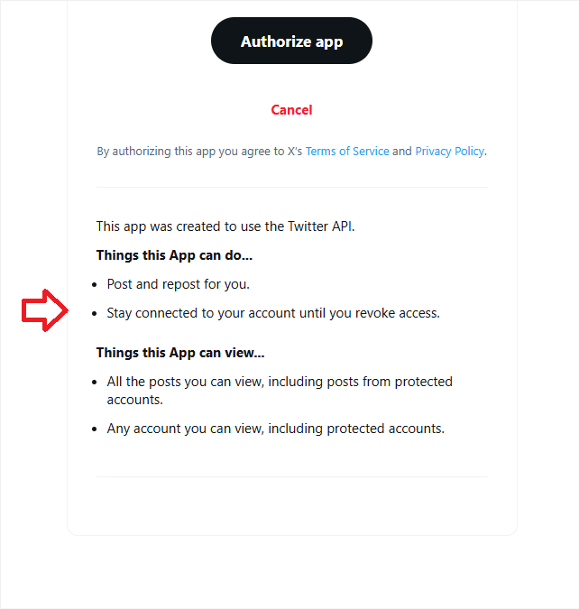

# OpenAPI client with OAuth2 authorization

OAuth2 is all about fetching an Access token. Authorization for all requests is done with an `Authorization` header
with scheme `Bearer`, followed by a plain text Access Token.


# Table of Contents

- [Preparation: adding Authorization header to a Kiota request](#preparation-adding-authorization-header-to-a-kiota-request)
- [Fetching an access token](#fetching-an-access-token)
  - [Step 1: authorization code](#step-1-authorization-code)
    - [Code challenge](#code-challenge)
    - [Handling the redirect url](#handling-the-redirect-url)
  - [Step 2: access token](#step-2-access-token)
  - [Refresh token](#refresh-token)
    - [Authorization](#authorization)
    - [Fetching the initial refresh token](#fetching-the-initial-refresh-token)
    - [Getting an access token from a refresh token](#getting-an-access-token-from-a-refresh-token)

# Preparation: adding Authorization header to a Kiota request

This chapter assumes that we already have an Access Token. Below is described to how fetch it.


We need an implementation of `Microsoft.Kiota.Abstractions.Authentication.IAccessTokenProvider` that is used to create
a `Microsoft.Kiota.Abstractions.Authentication.BaseBearerTokenAuthenticationProvider` which is used to create
a `Microsoft.Kiota.Http.HttpClientLibrary.HttpClientRequestAdapter`, and this one is used as an argument to create 
the Kiota generated REST client, in my sample it is the class `XClient`.

The `IAccessTokenProvider` provider in my sample looks like this:

```c#
public class XOAuth2AccessTokenProvider : IAccessTokenProvider
{
  private string accessToken;
  public XOAuth2AccessTokenProvider(string accessToken)
  {
    this.accessToken = accessToken;
  }
  public Task<string> GetAuthorizationTokenAsync(Uri uri, Dictionary<string, object>? additionalAuthenticationContext = null, CancellationToken cancellationToken = default)
  {
    return Task.FromResult(this.accessToken);
  }

  public AllowedHostsValidator AllowedHostsValidator => throw new NotImplementedException();
}
```
You just provide it an access token.

This token provider is used to create a API client:

```c#
XOAuth2AccessTokenProvider accessTokenProvider = new XOAuth2AccessTokenProvider(accessToken);
BaseBearerTokenAuthenticationProvider authProvider = new BaseBearerTokenAuthenticationProvider(accessTokenProvider);
HttpClientRequestAdapter adapter = new HttpClientRequestAdapter(authProvider);

XClient client = new XClient(adapter);
```

Now you can make API requests:

```c#
Get2UsersMeResponse response = await client.Two.Users.Me.GetAsync();
```


Note that this handling of the access token is rather simplified. As it expires after two hours, you should refresh it regularly.

# Fetching an access token

We use the [OAuth 2.0 Authorization Code Flow with PKCE](https://docs.x.com/fundamentals/authentication/oauth-2-0/authorization-code)
to fetch an access token which allows us to make requests on behalf of a user.

OAuth2 also provides [app-only bearer tokens](https://docs.x.com/fundamentals/authentication/oauth-2-0/bearer-tokens), 
but they can only be used for a few X features, so I just ignore them.

## Step 1: authorization code
We browse to an url that looks like this:

```
https://x.com/i/oauth2/authorize?response_type=code&client_id={clientId}&redirect_uri={encodedRedirectURL}&scope={scopes}&state=state&code_challenge=challenge&code_challenge_method=plain
```


The url contains several parameters:
* `client_id`: this is the client id of your application
* `redirect_uri`: this is the url encoded redirect url that is configured in your application. Mostly, it is is `http://localhost`,
  which is encoded as `http%3A%2F%2Flocalhost`
* `scope` is a list of requested privileges (separated by a space char), e.g. `users.read tweet.read tweet.write`. As the must be URL encoded,
  they should be `users.read%20tweet.read%20tweet.write`.
* `state` contains a string value that is provided to the call of the redirect url. It is used to validate in the redirect url that 
  it the call is the expected one and it is meant to prevent CSRF attacks.
* `code_challenge` and `code_challenge_method`: this is the PKCE (Proof Key for Code Exchange) part: the `code_challenge_method` can be `plain`
or `S256`. The sample url above uses `plain`, which is actually discouraged (but even the X doc only explain this). More details see below.


This authorization url is opened in an embedded browser control or (if the embedded browser control is not available) in a web browser.

### Code challenge
The `code_challenge` and the `code_challenge_method` are sent to the server as part of the authorization url. On successful authorization, you will receive an 
authentication code, which is used to fetch the access token. And in this step, you will provide
the `code_verifier`.

There are two methods: `plain` and `S256`.

**Method `plain`**: `code_challenge` and `code_verifier` contain the same string.

**Method `S256`**: the X doc does not describe it, but look e.g. here: 
[Add Login Using the Authorization Code Flow with PKCE](https://auth0.com/docs/get-started/authentication-and-authorization-flow/authorization-code-flow-with-pkce/add-login-using-the-authorization-code-flow-with-pkce).

The `code_verifier` is again the original string (in my sample it is a random string).

The `code_challenge` contains a SHA256 hash of this string. It must be Base64 encoded, and three characters must be replaced:
* "+" becomes "-"
* "/" becomes "/"
* "=" is removed.

The C# code might look like this (snippet is taken from my implementation which uses `netstandard2.0`, so more elegant API might exist in 
newer .NET versions):

```c#

using var hash = SHA256.Create();
byte[] result = hash.ComputeHash(Encoding.UTF8.GetBytes(plainText));

//Build "challenge": it must be Base64 encoded:
string challenge = Convert.ToBase64String(result);

challenge = challenge.Replace("+", "-");
challenge = challenge.Replace("=", "");
challenge = challenge.Replace("/", "_");
```

### Handling the redirect url
It is configured as part of the X app settings, and for desktop applications it could be `http://localhost`:


After completing the authorization process in the browser, you are redirected to this url, and the request url contains the authentication code
parameter. There are two ways to handle it.
* start a small webserver listening to this url. This is probably difficult to handle
* better: use a embedded web browser control and intercept the redirection to this url. We will use this approach.

In my sample I use WinForms UI, so I can use the `Microsoft.Web.WebView2.WinForms.WebView2` control from nuget package `Microsoft.Web.WebView2`:

```xml
  <ItemGroup>
    <PackageReference Include="Microsoft.Web.WebView2" Version="1.0.3719.77" />
  </ItemGroup>
```

I placed it in a form that is shown as a modal dialog. In `OnLoad` of the form, I navigate to the authorization url:

```c#
this.webBrowser.Source = new Uri(authorizeUrl);
```

Now the user performs a login and confirms the requested scopes. After completing this step (or when clicking "cancel"), the browser
is redirected to the redirect url. And here we can kick in and intercept this navigation, parse the authentication code from the url
and close the dialog. We do so be handling the event `WebBrowserControl.NavigationCompleted`:

```c#
private void webBrowser_NavigationCompleted(object sender, CoreWebView2NavigationCompletedEventArgs e)
{
  if (this.webBrowser.Source.AbsoluteUri.StartsWith(redirectURL))
  {
    NameValueCollection queryArgs = HttpUtility.ParseQueryString(this.webBrowser.Source.Query);

    if (queryArgs["error"] != null)
    {
      //"Cancel" was clicked. Cancel this form.
      this.DialogResult = DialogResult.Cancel;
      this.Close();
      return;
    }
    else
    {
      //Success:
      string? code = queryArgs["code"];
      //Store the code:
      this.AuthorizationCode = code;

      this.DialogResult = DialogResult.OK;
      this.Close();

    }
  }
}
```

On successful login, the url looks like this:

```
http://localhost/?state=state&code=UkZJQ0d6RVZQbGVwdE...6MTowOmFjOjE
```

The "code" parameter is the authentication code required in the next step.

If the user clicks "cancel" in the last step, the url looks like this:
```
http://localhost/?error=access_denied&state=state
```
It contains an "error" parameter.

For both versions, the client code should check that the `state` parameter contains the same value that was set when creating the authorize url.

## Step 2: access token

Now we send a POST request to the URL `https://api.x.com/2/oauth2/token`

This call differs slightly, depending on the application type: in the configuration of the app, you choose between 
"Public client" and "Confidential client". 


The X definition is:

*Confidential clients can hold credentials in a secure way without exposing them to unauthorized parties and securely 
authenticate with the authorization server they keep your client secret safe. Public clients as they’re usually running 
in a browser or on a mobile device and are unable to use your client secrets.*

I did not see much difference in the authorization process: both client types must do the step that a user logs in to X and confirms
the scopes for the app. So it is probably safe to also use the type "Public client" (no need for a client secret) for background services.

First of all I defined a helper class that mimics the token response:

```c#
public class GetTokenResponse
{
  [JsonPropertyName("token_type")]
  public string TokenType
  {
    get;
    set;
  } = string.Empty;

  [JsonPropertyName("expires_in")]
  public int ExpiresIn
  {
    get;
    set;
  }

  [JsonPropertyName("access_token")]
  public string AccessToken
  {
    get;
    set;
  } = string.Empty;

  [JsonPropertyName("refresh_token")]
  public string RefreshToken
  {
    get;
    set;
  } = string.Empty;

  [JsonPropertyName("scope")]
  public string Scope
  {
    get;
    set;
  } = string.Empty;
}
```

For fetching the token, we need some parameters:
* client_id : the client id (onyl required for public client)
* redirect_uri: the redirect uri (though not used for anything)
* code: the authorization code fetched in step 1
* grant_type: must be "authorization_code"
* code verifier: the verifier part of the code challenge (see above)

The full code for fetching the token looks like this:

First the **public client** version:
```c#
Dictionary<string, string> formData = new Dictionary<string, string>();
formData.Add("code", authorizationCode);
formData.Add("grant_type", "authorization_code");
formData.Add("client_id", clientId);
formData.Add("redirect_uri", redirectUrl);
formData.Add("code_verifier", codeVerifier);

HttpClient client = new HttpClient();

HttpRequestMessage request = new HttpRequestMessage();
request.RequestUri = new Uri("https://api.x.com/2/oauth2/token");
request.Method = HttpMethod.Post;

request.Content = new FormUrlEncodedContent(formData);
```

The **confidential client** version:

```c#
Dictionary<string, string> formData = new Dictionary<string, string>();
formData.Add("code", authorizationCode);
formData.Add("grant_type", "authorization_code");
formData.Add("redirect_uri", redirectUrl);
formData.Add("code_verifier", codeVerifier);

HttpClient client = new HttpClient();

HttpRequestMessage request = new HttpRequestMessage();
request.RequestUri = new Uri("https://api.x.com/2/oauth2/token");
request.Method = HttpMethod.Post;

request.Content = new FormUrlEncodedContent(formData);

//Concat with colon and encode base64:
string header = clientId + ":" + clientSecret;
header = Convert.ToBase64String(Encoding.UTF8.GetBytes(header));
request.Headers.Authorization = new AuthenticationHeaderValue("Basic", header);
}
```

Here, no client_id parameter is added to the POST data, but instead a `Authorization` header with scheme `Basic` is added, that contains client id
and client secret.
I noticed that I can use this approach also if the app is configured as "public client". Here the client secret value does not seem to matter,
I can specify anything. It is only checked for a "confidential client". 


The next step is the same for public and confidential client: 

```c#
// Send the request:
HttpResponseMessage response = await client.SendAsync(request);

string responseFromServer = await response.Content.ReadAsStringAsync();

GetTokenResponse tokenResponse = JsonSerializer.Deserialize<GetTokenResponse>(responseFromServer);

response.Dispose();
request.Dispose();
client.Dispose();
```

the server sends a response like this:

```json
{
  "token_type": "bearer",
  "expires_in": 7200,
  "access_token": "Q09HZmxNTFdUaFJBNF9KUzh2M3BaemlHNkdIVWZvX3BpOHN6WDEwd0lyLWVkOjE3NzAwNTY2ODkyNTk6MTowOmF0OjE",
  "scope": "tweet.write users.read tweet.read"
}
```

The fields are:
* token_type is always `bearer`
* expires_in: time in seconds until the access token expires. Currently, it is always "2 hours"
* access_token: this is the access token
* scope: the scopes that we sent when authorizing. 

This response is mapped to the class `GetTokenResponse`. Note: the property "RefreshToken" is not used here, but see below.

Now we are done. Using this access token, we can perform X requests.

## Refresh token

As a access token has a limited lifetime, it cannot be used by background services. Here, we need a refresh token, and
every time we want to access X, we fetch a new access token by sending the refresh token. This request will also yield a new refresh token.

So, we can fetch a refresh token during initial interactive authorization. This token could be saved to a safe place, and the background service
could use it to fetch an access token. 

A refresh token can only be used once, so we have to take care that every time we fetch an access token, we replace the old refresh
token with the new one in our store. If this chain breaks somewhere, a user has to perform a login fo fetch a new refresh token.

### Authorization
During authorization in step 1, we add an additional scope `offline.access` 

This will be displayed in the last step of authorization where you confirm the privileges of the app:



### Fetching the initial refresh token
This happens automatically in step 2. Now the response also contains a refresh token.

```json
{
  "token_type": "bearer",
  "expires_in": 7200,
  "access_token": "Q09HZmxNTFdUaFJBNF9KUzh2M3BaemlHNkdIVWZvX3BpOHN6WDEwd0lyLWVkOjE3NzAwNTY2ODkyNTk6MTowOmF0OjE",
  "scope": "tweet.write users.read tweet.read",
  "refresh_token": "OEN4RUtLT3RiMlF0UFFxdkFuQUVMd01qRllnUWdoLVM5YXZKcm0xSVVjTjNCOjE3NzAwNTc1NTg4NjM6MTowOnJ0OjE"
}
```

This refresh token should be stored somewhere.

### Getting an access token from a refresh token

Our background service can fetch an access token by sending a `POST´ request to 

```
https://api.x.com/2/oauth2/token
```

The code looks like this:

```c#
Dictionary<string, string> formData = new Dictionary<string, string>();
formData.Add("refresh_token", refreshToken);
formData.Add("grant_type", "refresh_token");
formData.Add("client_id", clientId);


HttpClient client = new HttpClient();

HttpRequestMessage request = new HttpRequestMessage();
request.RequestUri = new Uri("https://api.x.com/2/oauth2/token");
request.Method = HttpMethod.Post;

request.Content = new FormUrlEncodedContent(formData);


// Send the request:
HttpResponseMessage response = await client.SendAsync(request);

string responseFromServer = await response.Content.ReadAsStringAsync();

GetTokenResponse? tokenResponse = JsonSerializer.Deserialize<GetTokenResponse>(response.Data);

response.Dispose();
request.Dispose();
client.Dispose();
```


Main difference to the "fetch an access token by authorization code" step: the `grant_type` argument is now `refresh_token`,
and we specify an argument `refresh_token`.